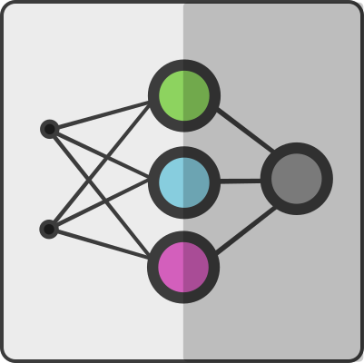

# Layer-Classifier
------
 App for layer classification(collector, tire) using **Back Propagation** and **Resilient Propagation** Neural Nets.

# Build and run
- Navigate to project parent folder and run `gradle build` to build the project 
- Then `gradle run` or `java -jar build/libs/Layer-Classifier-[version].jar` to run it

> Note: To run this application you need [Java SE 1.8.0_40+](http://www.oracle.com/technetwork/java/javase/downloads/jdk8-downloads-2133151.html) and [Gradle 2+](https://gradle.org/install)

## Main Window
Main window contains two tables with real and training data, select-box with neural net types and text area for results logging.
To start training you should first fill out training data table.

## Training Settings
When you click on train button - training settings pop-up menu shows up. In this menu you can customize learning speed, max iterations and max available error of neural net.

## Error decreasing Graphs
After training, error decreasing chart shows up. This chart represent value of error on each iteration.

## Artificial Value Generation
You can write real data by hand or generate artificial values to test neural net. To generate artificial values just click on generate button and then write amount of rows which should be generated.

## Classifying
When you press solve button neural net classifies layers on tire or collector (Don't forget to train neural net before run classification).

# License
Layer-Classifier is released under the [MIT License](https://opensource.org/licenses/MIT).
